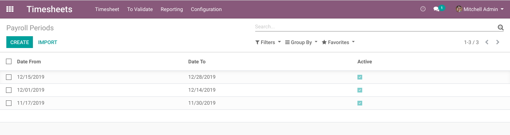
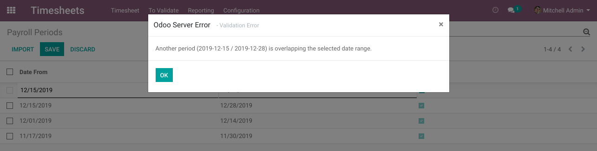

Payroll Periods
===============
This module adds payroll periods as an Odoo model.

Constraints
-----------
Two payroll periods for the same company can not have ovelapping dates.
Otherwise, an blocking message will be shown.

Known Issues
------------
The module adds a list view for payroll periods.
However, it does not add a menu entry for accessing this list.
We suggest to add a menu entry in a specific application.

Contributors
------------
* Numigi (tm) and all its contributors (https://bit.ly/numigiens)
