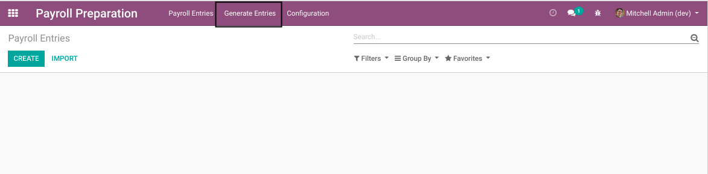
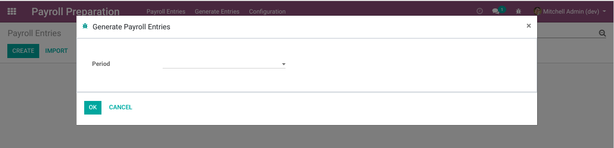
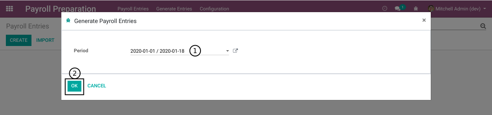
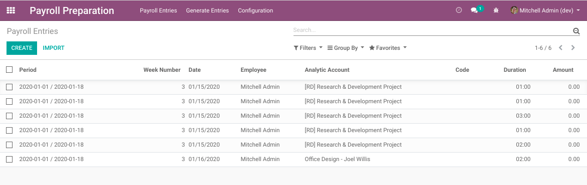

Payroll Preparation From Timesheet
==================================
This module allows to import payroll entries (payroll preparation lines) from timesheets.

.. contents:: Table of Contents

Usage
-----
As ``Payroll Preparation / Manager``, I find a new menu item ``Generate Entries``.

After clicking on the menu item, a wizard opens.

I select a payroll period and click on ``OK``.

In the list of payroll entries, I notice that new entries have been generated for the period.

Module Design
-------------
The module generates one payroll entry per timesheet line.
This single payroll entry represents the hourly wage of the employee.

Hourly Rate
~~~~~~~~~~~
The module does not decide what the employee's hourly rate must be.
This can be implemented in another module (based on the employee contract for example).

Other Types of Entries
~~~~~~~~~~~~~~~~~~~~~~
The wizard can also be extended by other modules to generate extra payroll entries,
(such as night shift premiums or vacations for example).

Contributors
------------
* Numigi (tm) and all its contributors (https://bit.ly/numigiens)
