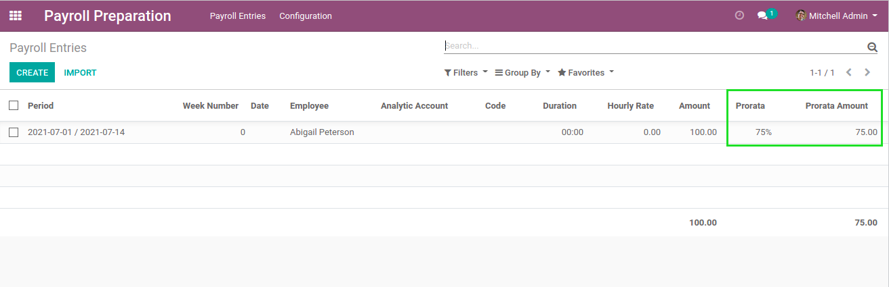
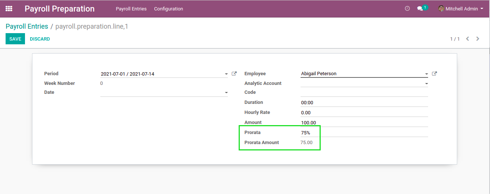

Payroll Preparation Prorata
===========================
This module adds two fields ``Prorata`` and ``Prorata Amount`` on payroll preparation entries.

The ``Prorata`` indicates the percentage of the amount that should be paid for an entry.
By default, it is 100%.

The ``Prorata Amount`` is computed as the amount multiplied by the prorata.

Contributors
------------

The `Numigi <https://numigi.com/r/home>`_ team is the contributor to this project. We help Quebec companies implement Odoo and Konvergo ERP.
