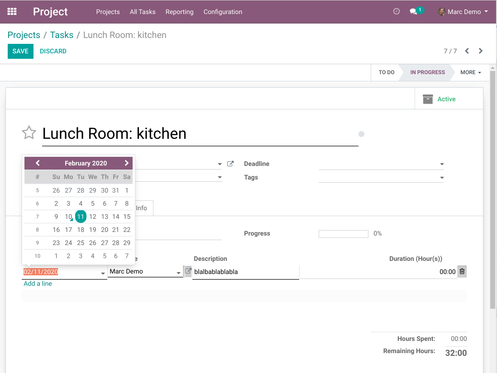
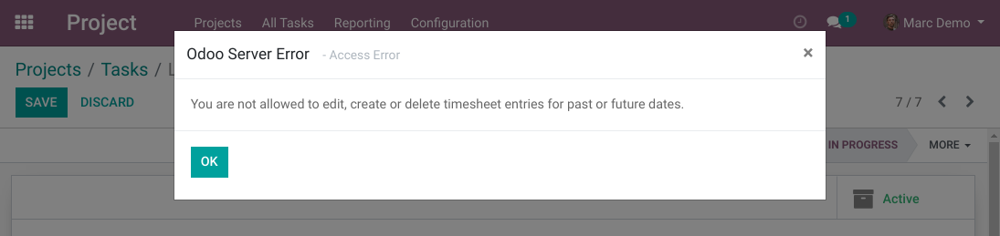

Timesheet Edit Only Today
=========================
This module restricts the edition of timesheets.

.. contents:: Table of Contents

Context
-------
In vanilla Odoo, users can edit their own timesheets without restriction on the date.

Summary
-------
With this module installed, basic users can only create / edit timesheet lines for the current date.

Only timesheet managers are able to edit timesheet lines of previous and future days.

Usage
-----
As member of the group ``Timesheet / User``, I try to create a timesheet line in the past.

When I save, an error message is displayed.

Contributors
------------
* Numigi (tm) and all its contributors (https://bit.ly/numigiens)
