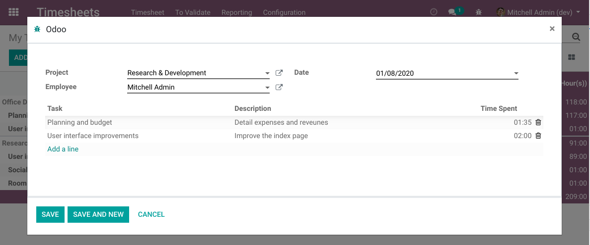
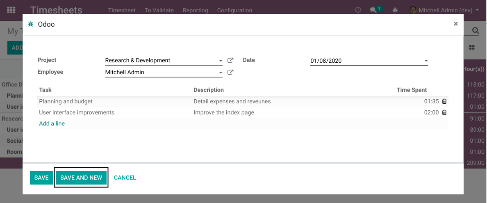
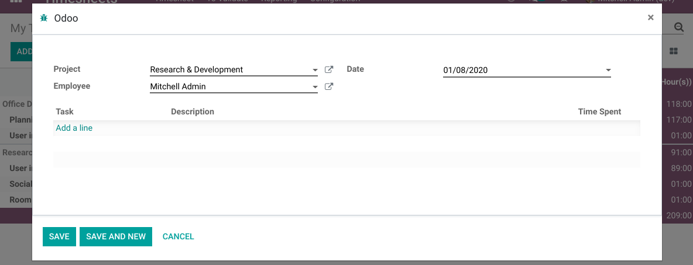

Timesheet Multi Line Wizard
===========================

.. contents:: Table of Contents

Context
-------
In some companies, timesheets are manually filled in Odoo by a manager.

Entering multiple timesheet entries for multiple employees and projects can take a lot of time.
This module mitigates this issue by simplifying the entry of timesheets.

Usage
-----
This module adds a new wizard that allows to enter multiple timesheet lines with common parameters.

After saving, for each line in the table, a new timesheet entry is created.

The parameters defined in the wizard (Project, Employee, Date, etc)
are propagated to the new timesheet entries.

Save and New
------------
When clicking on ``Save and New``, the timesheets are created and a new wizard is opened
with the same parameters.

This allows for example to enter timesheets for the same day, but with a different employee.

Known Issues
------------
This module does not define where the user should click to open the wizard in the first place.

The module ``timesheet_multi_line_wizard_grid`` allows to open the wizard from the timesheet grid view.
This was separated into another module because the grid view is an ``Odoo Enterprise`` feature.

Contributors
------------
* Numigi (tm) and all its contributors (https://bit.ly/numigiens)
