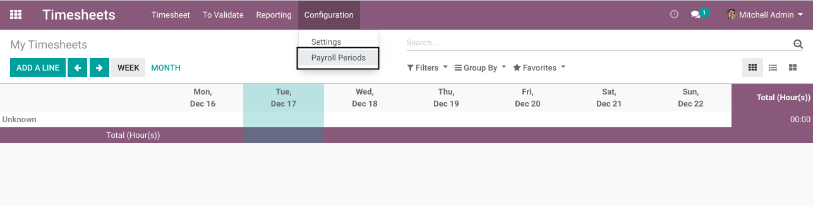
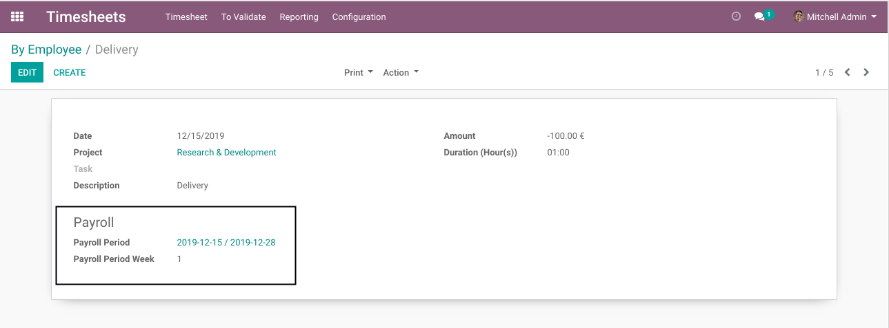

Timesheet Payroll Periods
=========================

.. contents:: Table of Contents

Configuration
-------------
This module adds a menu entry in the ``Timesheets`` application to configure payroll periods.

Timesheets
----------
In the form view of timesheet entries, as ``Timesheet / Manager``, I can see the following new fields:

* Payroll Period
* Payroll Period Week

These fields are automatically computed based on the configured payroll periods.

By default, non-members of ``Timesheet / Manager`` do not see the new fields.

Recomputation
-------------
If a modification is done to the configuration of periods,
relevant timesheets entries are automatically updated to reflect the change.

Contributors
------------
* Numigi (tm) and all its contributors (https://bit.ly/numigiens)
