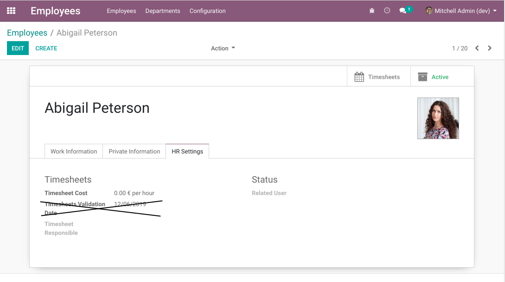
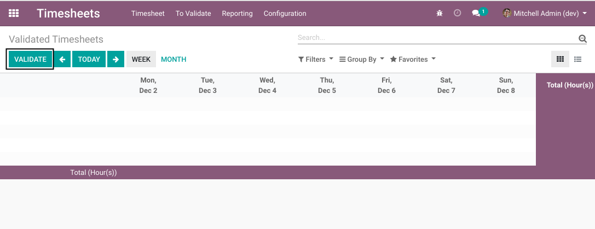

Timesheet Validation Status / Enterprise
========================================
This module is a binding between ``timesheet_validation_status`` and Odoo enterprise.

.. contents:: Table of Contents

Timesheet Validation Date
-------------------------
The timesheet validation date is hidden on the employee form view.

Timesheet Validation Button
---------------------------
When clicking on the ``Validate`` button of the grid view,
instead of the Odoo enterprise mecanism, the validation mecanism based on timesheet status is called.

Contributors
------------
* Numigi (tm) and all its contributors (https://bit.ly/numigiens)
