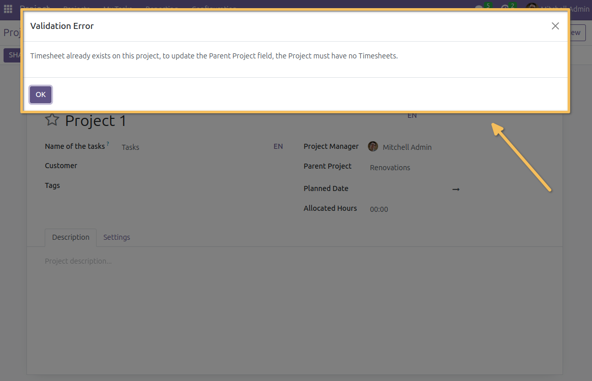
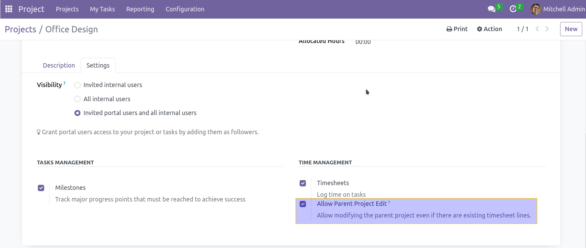
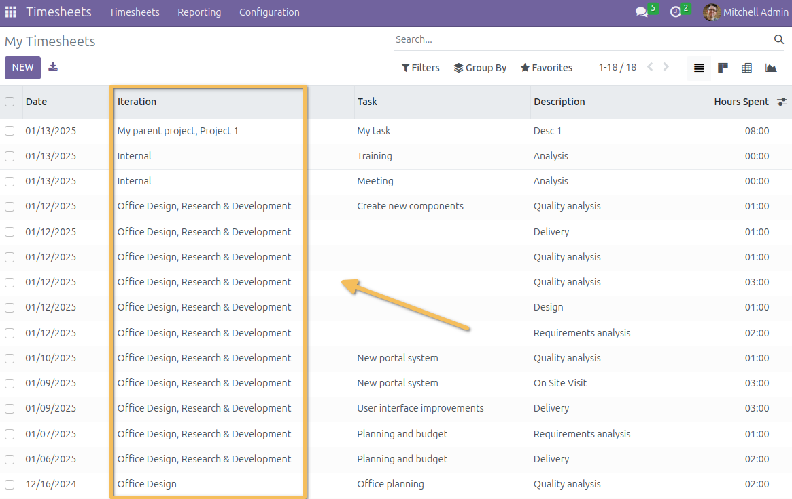
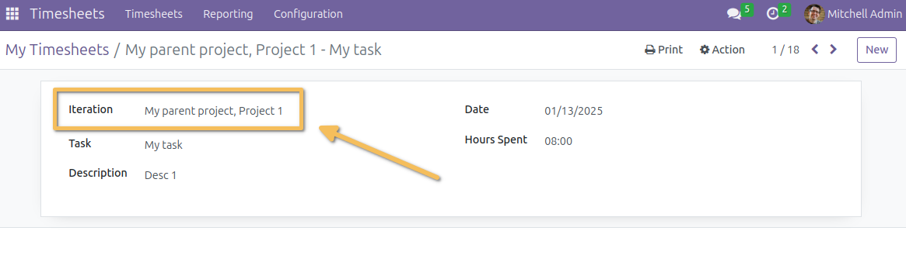
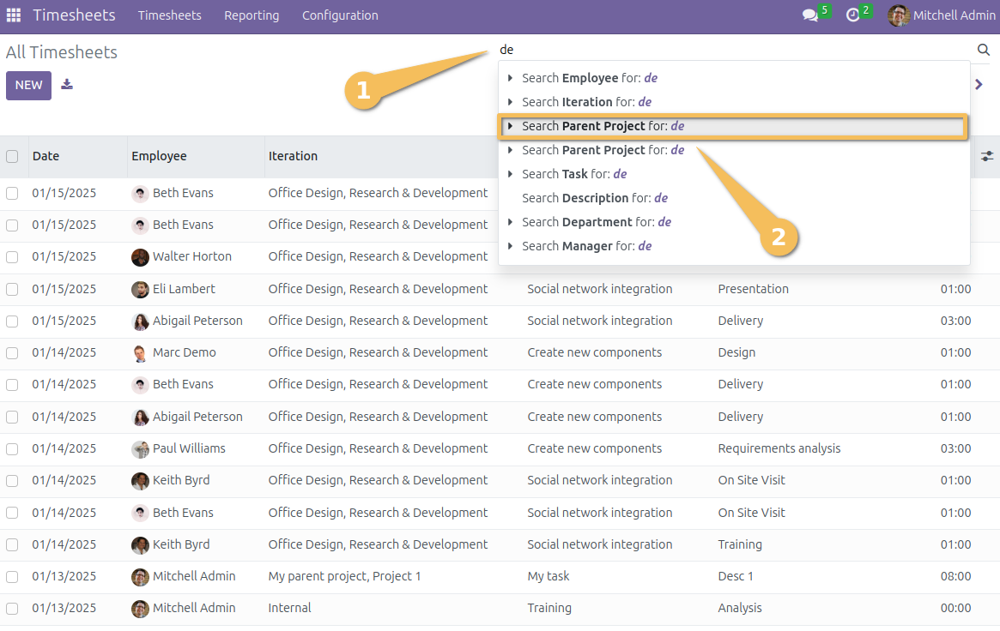

Hr Timesheet Project Parent Enhanced
====================================

This module adds constraints and features related to timesheets and parent-child relationships between projects. It enhances the existing functionalities provided by the OCA module `project_parent`, with a focus on timesheets and their integration into project hierarchies.

Dependencies
------------
This module depends on the following OCA module:
- `project_parent`: https://github.com/OCA/project/tree/16.0/project_parent

Features
--------

**Parent Project on Timesheets**
    - Adds the `parent_project_id` field to timesheets (`account.analytic.line`) to store the parent project of the linked iteration or project.

    - Automatically computes the parent project based on the hierarchy:

    - If the project has no parent, the `parent_project_id` is the project itself.

    - Otherwise, the `parent_project_id` corresponds to the direct parent of the project.

**Constraints on Parent Project Changes**

    - This module introduces a configuration option that allows changing the parent project of a project even if it already contains timesheet entries. 

    By default, this option is disabled, to **Raise ValidationError**  on changing parent project if 
    timesheets already exist for the project.However, when enabled for a specific project, users can 
    update the parent project without encountering validation constraints.

    This setting can be configured in the **project form view** .

**Enhanced Views**
    - Displays the parent project in analytic line views for better visibility (either in list or form view).
    eg. : `My parent project, My iteration`

    - Allows filtering timesheets based on the parent project.

Contributors
------------
- Numigi (tm) and all its contributors (https://bit.ly/numigiens)

More Information
----------------
For more details, visit:
- https://github.com/OCA/project/tree/16.0/project_parent
