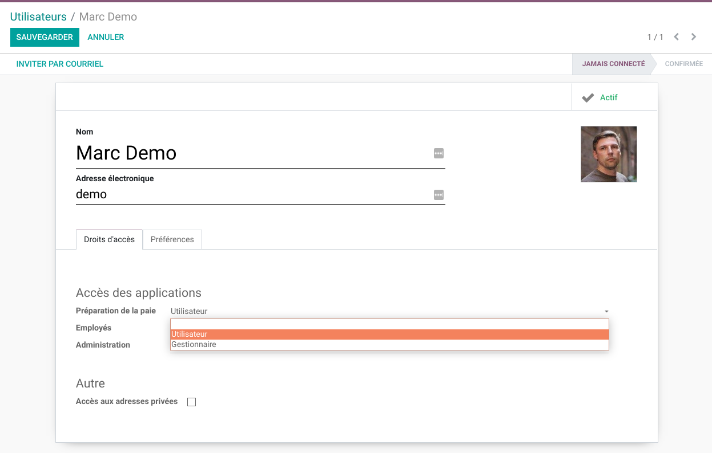

Payroll Preparation
===================
This module defines an application to manage the preparation of payroll.

.. contents:: Table of Contents

Context
-------
By preparation of payroll, we meen the gathering of relevant data to process a payslip.
It is a very distinct process from the actual computing of payroll.

Many companies outsource the production of their payslips.
However, the worked hours and other data required to produce payslips is kept somewhere else.

Module Design
-------------
The module defines a new model ``Payroll Entry`` (or ``Payroll Entry``).

This model is intended to be exported as data for an external payroll system.
It can also be used to import data from an external system so that the computation can be done in Odoo.

The module does not define how to generate the payroll entries.
This should be implemented in another module.

User Groups
-----------
Two new user groups are added:

* ``Payroll Preparation / User``
* ``Payroll Preparation / Manager``

The ``User`` has access in ``Read`` mode to the application.
The ``Manager`` has access in ``Read / Write / Create`` mode to the application.

By default, a payroll entry can not be deleted (except by a superuser).

Usage
-----
In the main application panel, I see a new entry ``Payroll Preparation``.

.. image:: static/description/app_panel_menu.png

When entering the application, I see the list of payroll entries.

.. image:: static/description/payroll_preparation_line_list.png

Payroll Periods
~~~~~~~~~~~~~~~
As ``Payroll Preparation / Manager``, under ``Configuration / Payroll Periods``,
I can configure the available payroll periods.

.. image:: static/description/payroll_period_list.png

For more information about payroll periods, see the module `payroll_period <https://github.com/Numigi/odoo-timesheet-addons/tree/12.0/payroll_period>`_.

Contributors
------------
* Numigi (tm) and all its contributors (https://bit.ly/numigiens)
