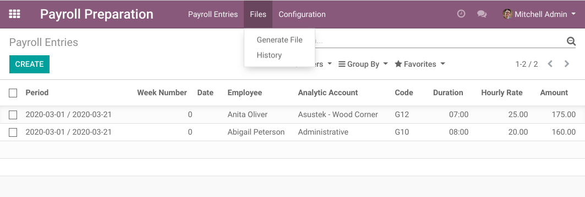
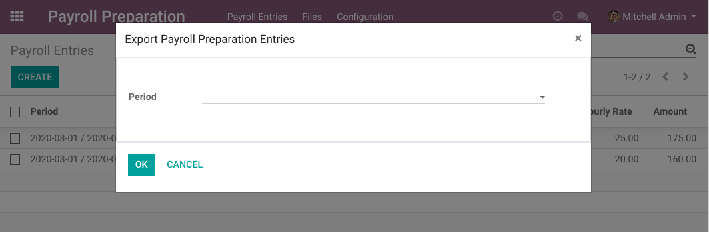
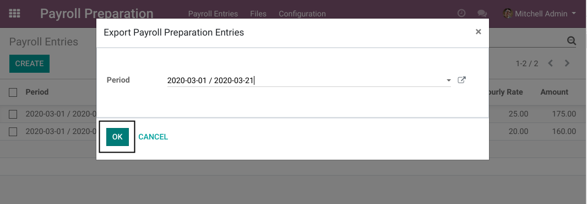
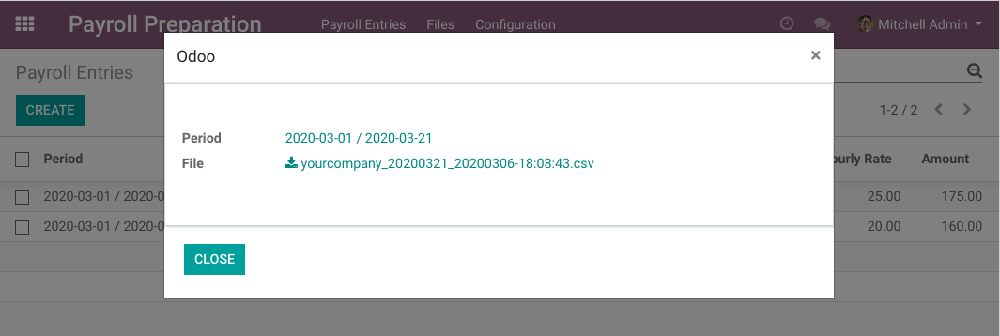
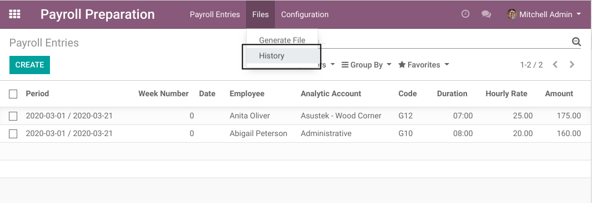

Payroll Preparation Export Wizard
=================================
This module adds a wizard to export payroll preparation entries into a file and track what was exported.

.. contents:: Table of Contents

Module Design
-------------
The module itself does not define what kind of file is exported.
It the format could be plain text, json, csv, etc.

What file is generated and what exactly the file contains must be implemented in another module.

Implementing a File Format
~~~~~~~~~~~~~~~~~~~~~~~~~~
To implement a type of file, you must inherit the model ``payroll.preparation.export``
and override the method ``generate_file``.

.. code-block:: python

    from odoo import models

    class PayrollPreparationExport(models.TransientModel):

        _inherit = 'payroll.preparation.export'

        def generate_file(self, lines):
            ...
            self.filename = the_file_name
            self.file = the_file_content_in_base64

The method ``generate_file`` takes a single parameter ``lines``.
This parameter contains the payroll.preparation.line entries for the selected period.

Usage
-----
As ``Payroll Preparation / Manager``, I find a new menu ``Files``.

This menu contains 2 entries:

* ``Generate File``
* ``History``

I click on ``Generate File``.

A wizard is opened.

I select a payroll period and click on ``OK``.

The wizard is reopened with the generated file.

I download the file, then I click on ``Close``.

I click on the ``History`` menu item.

I see my generated file in the list.

I can see who generated the file and when.

In the form view, I can download the file again.

Contributors
------------
* Numigi (tm) and all its contributors (https://bit.ly/numigiens)
