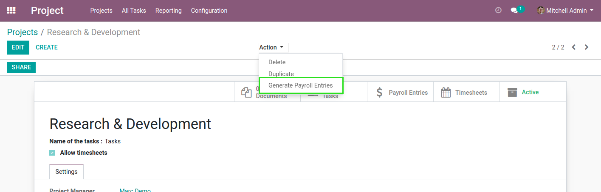
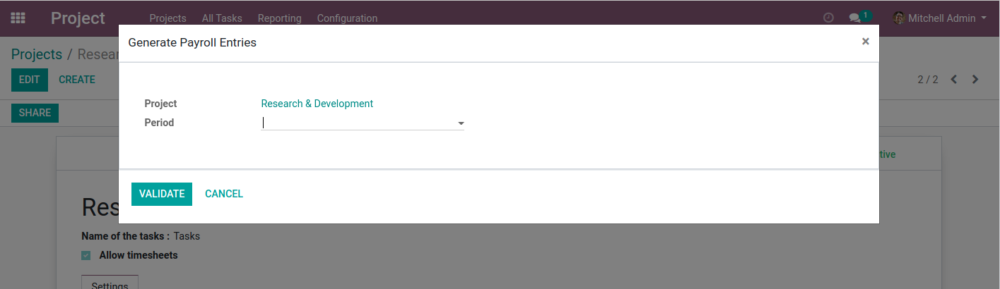
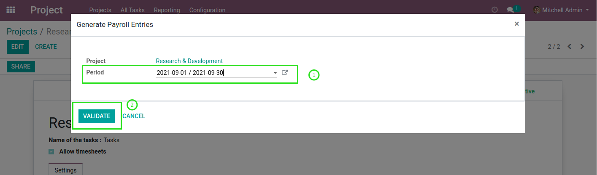
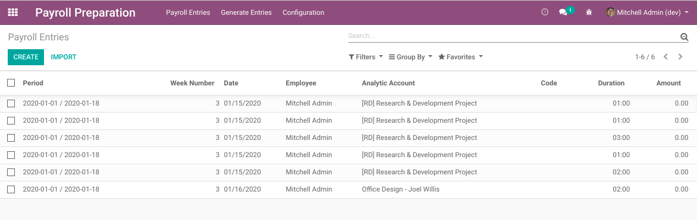
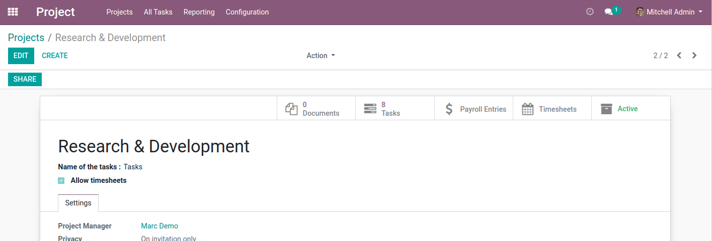
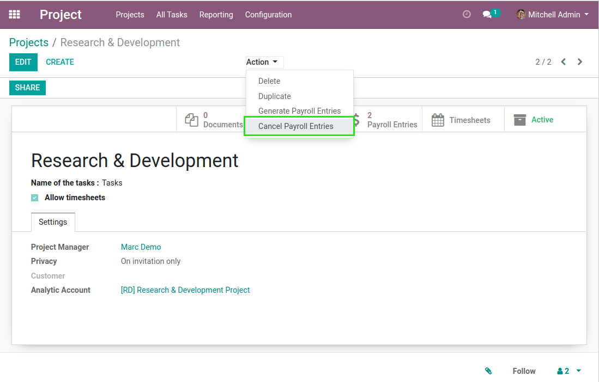
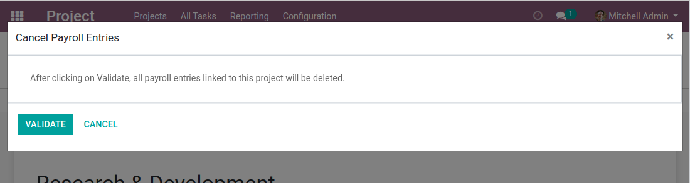

Payroll Preparation From Project
================================

.. contents:: Table of Contents

Overview
--------
This module allows to generate payroll entries from a project.

When only this module is installed, no payroll entries are generated.

However, another module can implement how the preparation lines are created for a given project.

Usage
-----

Generate Payroll Entries
~~~~~~~~~~~~~~~~~~~~~~~~
In the form view of a project, a new action button is added.

When clicking on this button, a wizard is open.

The wizard allows to select a payroll period.

After clicking on ``Validate``, payroll entries are created for this project.

Project Smart Button
~~~~~~~~~~~~~~~~~~~~
The module also adds a smart button in the form view of a project.

When I click on the button, I see the list payroll entries generated from this project.

Cancel Payroll Entries
~~~~~~~~~~~~~~~~~~~~~~
The module allows to cancel (meaning delete) payroll entries linked to a project.

When doing so, a validation wizard is open.

After validating, any payroll entry linked to the project is deleted.

Contributors
------------
* Numigi (tm) and all its contributors (https://bit.ly/numigiens)
