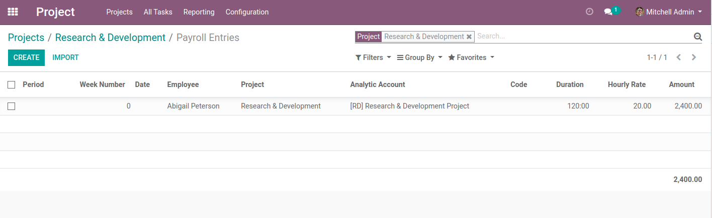

Payroll Preparation From Project
================================

.. contents:: Table of Contents

Overview
--------
This module allows to generate payroll entries from a project.

In the form view of a project, a new action button is added.

When clicking on this button, a wizard is open.

The wizard allows to select a payroll period.

After clicking on ``Validate``, payroll entries are created for this project.

Payroll Entries
---------------
When only this module is installed, no payroll entries are generated.

However, another module can implement how the preparation lines are created for a given project.

Contributors
------------
* Numigi (tm) and all its contributors (https://bit.ly/numigiens)
