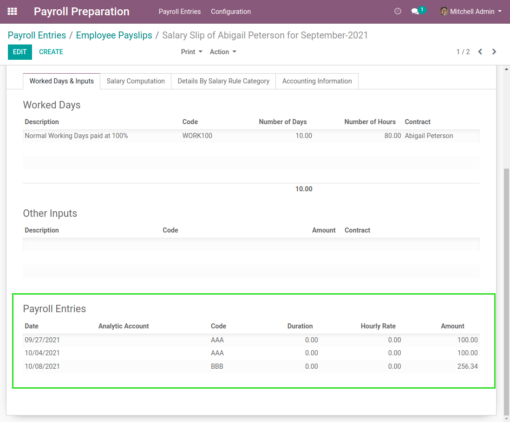

Payroll Preparation To Payslip
==============================

.. contents:: Table of Contents

Overview
--------
This module allows to generate payslips from payroll preparation entries.

Configuration
-------------

Salary Rules
~~~~~~~~~~~~
I open the form view of a salary rule.

I the python computation and condition fields, I can reference payroll entries.

The ``entries`` object works the same way as ``worked_days`` or ``inputs``.

Accessing an attribute of this object returns the sum of payroll entries with a code matching
the attribute name.

In the example above, the expression returns the sum of payroll entries with the code ``AAA``.

Usage
-----

Generate The Payslip
~~~~~~~~~~~~~~~~~~~~
As member of the groups ``Payroll Preparation / User`` and ``Payroll / Manager``, I go to the
list view of payroll entries.

I select a set of entries and I click on ``Generate Payslips``.

A confirmation wizard is opened.

When confirming, the payslips are created.

..

    By default, a single payslip is created per employee.

    The date range used as period for a payslip is based on the
    min and max dates of the related payroll entries.

I open a payslip.

I notice a new table ``Payroll Entries``, containing the list entries related to this payslip.

Payslip Computation
~~~~~~~~~~~~~~~~~~~
I click on ``Compute``.

.. image:: static/description/payslip_compute_button.png

I notice that my customized rule was computed based on the payroll entries.

.. image:: static/description/payslip_payroll_entries.png

Smart Button
~~~~~~~~~~~~
I notice a new smart button on the payslip.

When clicking on the button, the list of related payroll entries is displayed.

Deleting Payroll Entries
~~~~~~~~~~~~~~~~~~~~~~~~
The module prevents deleting a payroll entry linked to a payslip.

When doing so, a blocking message is displayed.

Contributors
------------
* Numigi (tm) and all its contributors (https://bit.ly/numigiens)
