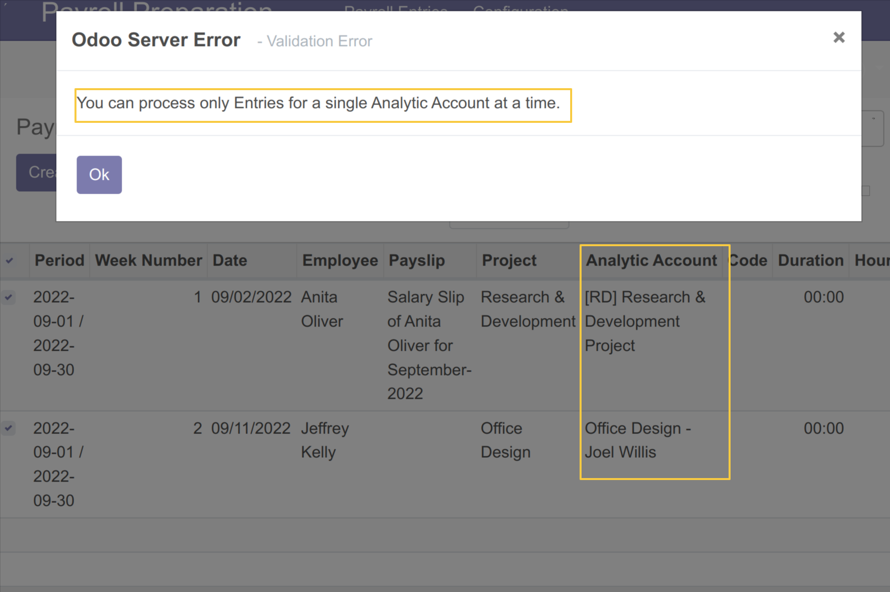
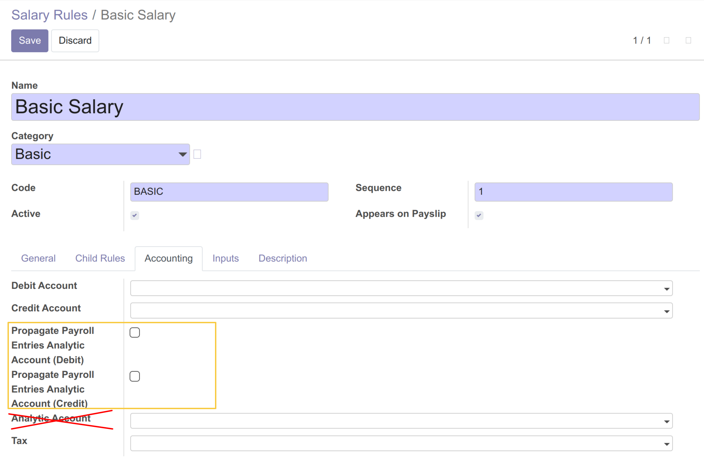
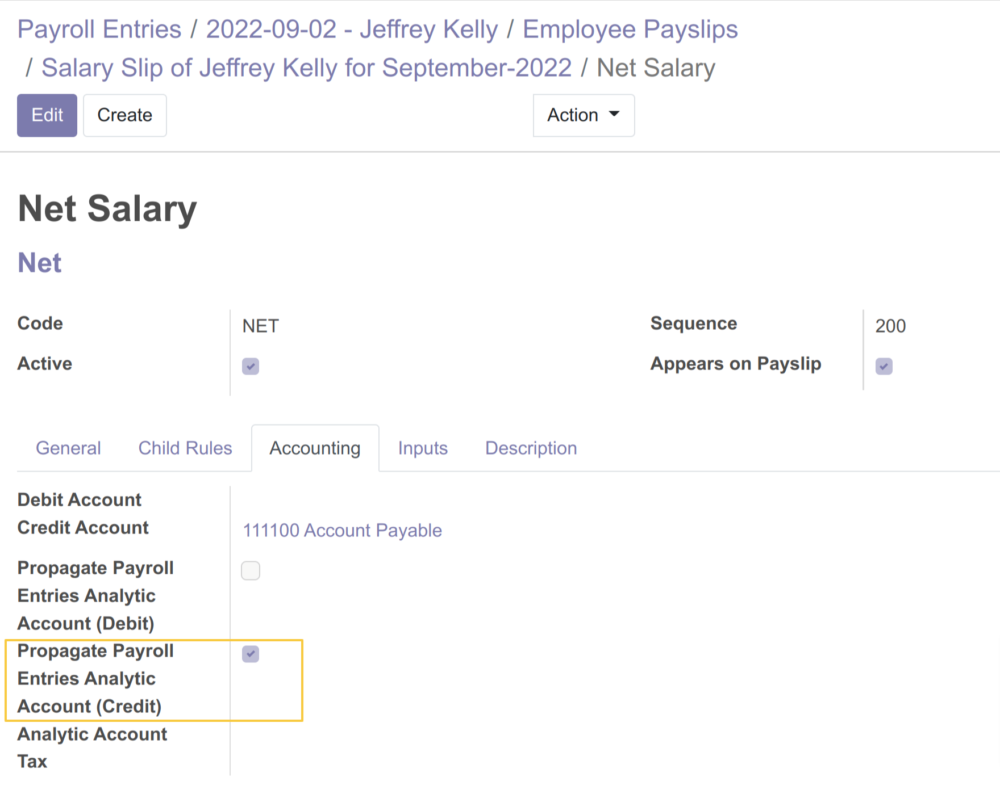
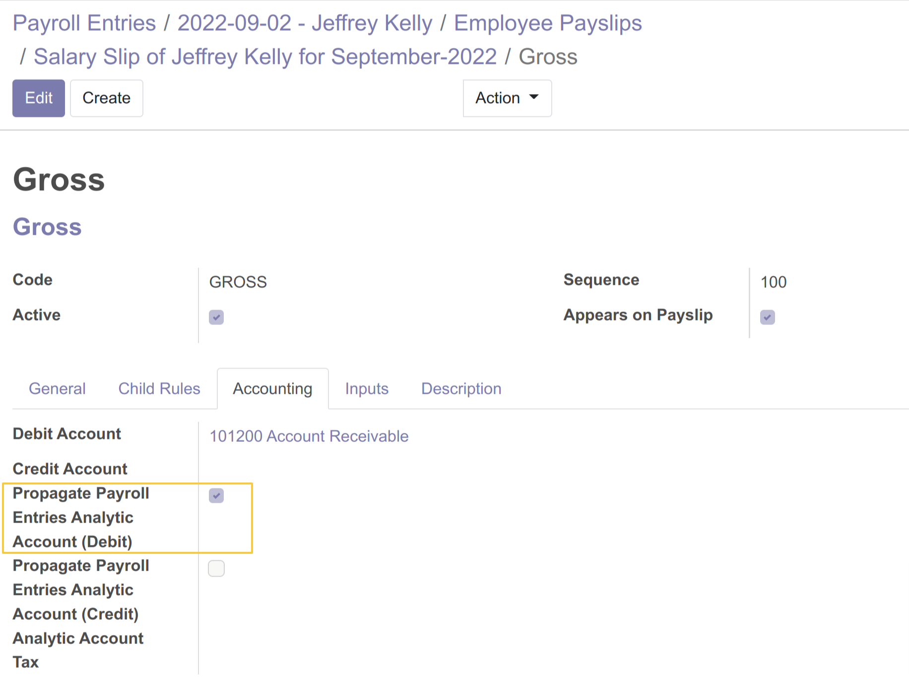
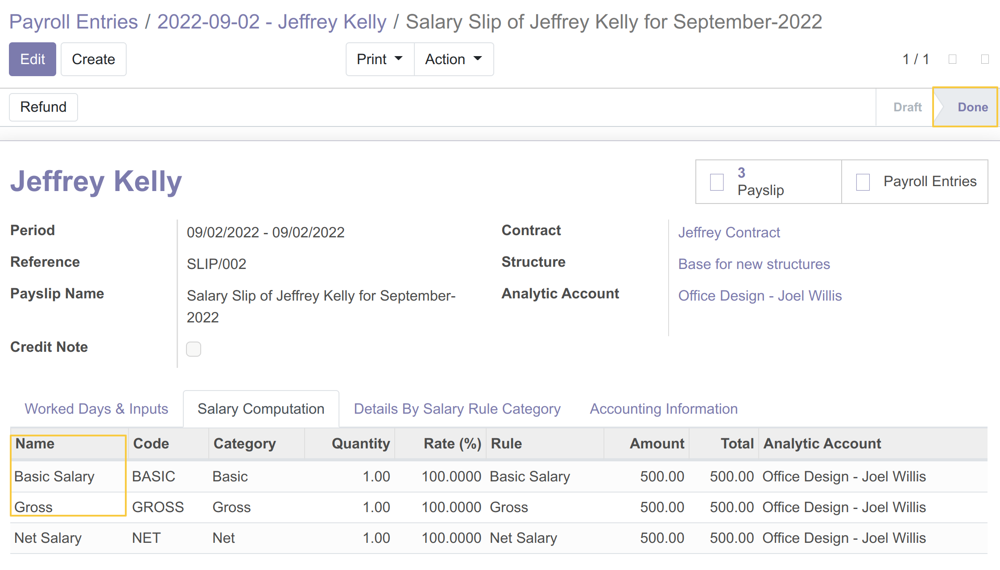
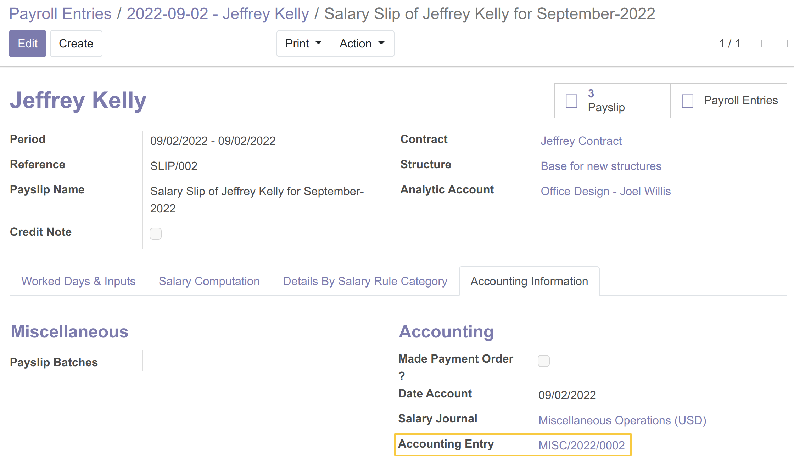
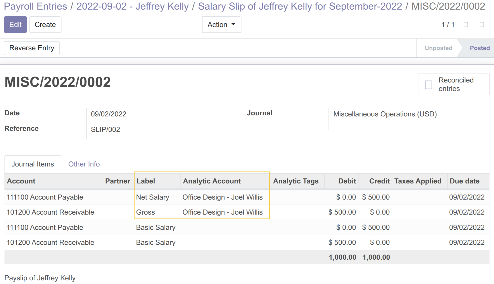

Payroll Preparation To Payslip Analytics
========================================

.. contents:: Table of Contents

Overview
--------
This module allows to:
- Systematically propagate the analytical account of payroll entries on the calculation lines of the payslip,
- Add a condition on the generation of accounting entries for the propagation of the analytical account from `Salary Computation Lines` to `Journal Item Lines`,

Usage
-----

Generate The Payslip
~~~~~~~~~~~~~~~~~~~~
As member of the groups `Payroll Preparation / User` and `Payroll / Manager`,

- I go to the form view of payroll entries, I see that the `Analytic Account` field has become mandatory:

- I go to the list view of payroll entries, I select a set of entries witch have the same analytic account and I click on `Generate Payslips`.
    .. image:: static/description/payroll_entries_generate_payslip.png

- I see that the analytic account is propagated on the Payslip and its calculation lines:
    .. image:: static/description/analytic_account_propagation_to_payslip.png

Uniqueness Constraint
~~~~~~~~~~~~~~~~~~~~~
- When I select a set of entries witch have different analytic accounts
  and I click on `Generate Payslips`, a blocking message is displayed.

Configuration
~~~~~~~~~~~~~
As member of the groups `Payroll / Manager`,
I go to the form view of a `Salary Rule`, Tab `Accounting`.
I see that the Analytic Account field is no longer displayed, and two checkboxes fields are added:
- Propagate Payroll Entries Analytic Account (Debit)
- Propagate Payroll Entries Analytic Account (Credit)

I check `Propagate Payroll Entries Analytic Account (Credit)` for `Net Salary`
and `Propagate Payroll Entries Analytic Account (Debit)` for `Gross`

I go to my payslip witch has the 2 salary rules in `Salary Computation Lines`,
then I confirm the Payslip.

I go to `Accounting Information Tab / Accounting Entry`
to display the `Accounting Entry` generated after confirming the payslip.

I can see that the `Analytic Account` has propagated on the lines of the `Accounting Entry`.

Contributors
------------
* Numigi (tm) and all its contributors (https://bit.ly/numigiens)

More information
----------------
* Meet us at https://bit.ly/numigi-com
