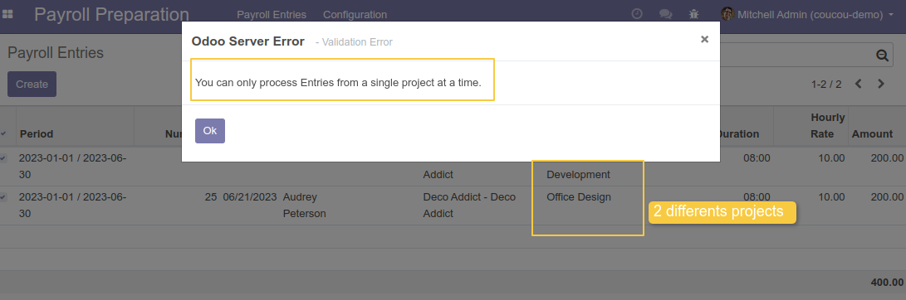
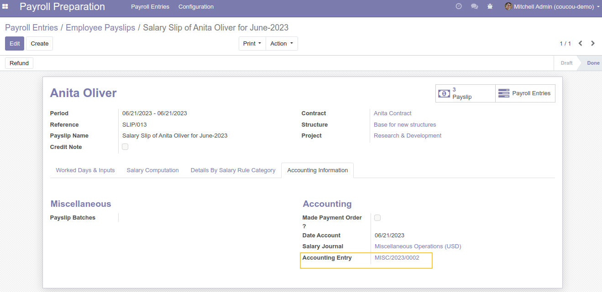

Payroll Preparation To Payslip Project
======================================

.. contents:: Table of Contents

Overview
--------
This module allows to:
- Systematically propagate the project of payroll entries on the calculation lines of the payslip,
- Systematically propagate the project from payslip to Accounting Entries Lines,
- Add a condition on the generation of accounting entries for the propagation of the project from `Salary Computation Lines` to `Journal Item Lines`,

Usage
-----

Generate The Payslip
~~~~~~~~~~~~~~~~~~~~
As member of the groups `Payroll Preparation / User` and `Payroll / Manager`,

- I go to the list view of payroll entries, I select a set of entries witch have the same project and I click on `Generate Payslips`.
    .. image:: static/description/payroll_entries_generate_payslip.png

- I see that the project field is added to the `Payslip` and it's value is propagated from the `Payroll Entries`:
    .. image:: static/description/payslip_form_project.png

Uniqueness Constraint
~~~~~~~~~~~~~~~~~~~~~
- When I select a set of entries witch have different project
  and I click on `Generate Payslips`, a blocking message is displayed.

Configuration
~~~~~~~~~~~~~
As member of the groups `Payroll / Manager`,
I go to my payslip witch has lines in `Salary Computation Lines`, then I confirm the Payslip.

I go to `Accounting Information Tab / Accounting Entry`
I display the `Accounting Entry` generated.

I can see that the `Project` has been propagated on the lines of the `Accounting Entry`.

.. image:: static/accounting_entry_lines_project.png

I go to the Journal Items (Accounting > Accounting > Accounting entries > Journal Items), I can find the accounting entries of the slip.
In all the lines of the accounting entries lines (account.move.line) generated by the payslip,
the project is not displayed in the list view but the list view can be:

- Filter by project
- Group by project
- and the user can export the project field.

.. image:: static/accouting_entries_line_filterby_project.png

.. image:: static/accouting_entries_line_groupeby_project.png

Contributors
------------
* Numigi (tm) and all its contributors (https://bit.ly/numigiens)

More information
----------------
* Meet us at https://bit.ly/numigi-com
