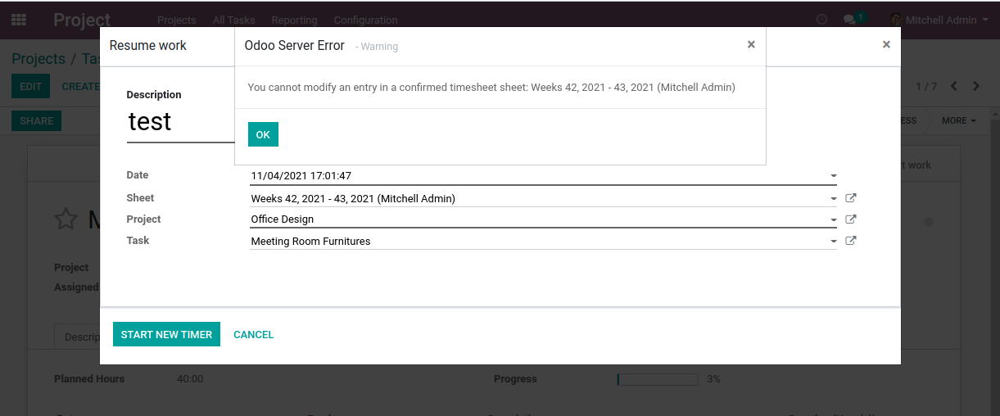
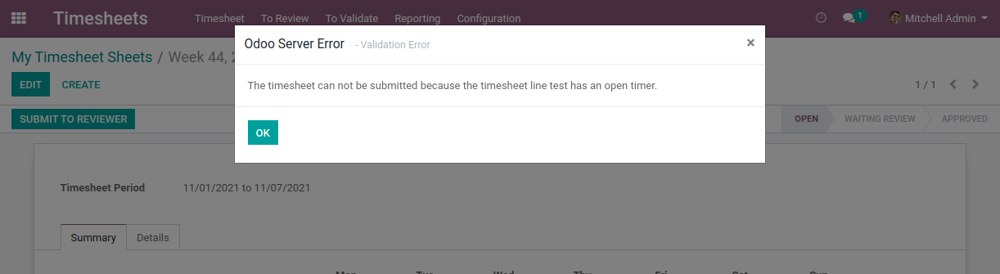

Project Timesheet Time Control Sheet
====================================

.. contents:: Table of Contents

Summary
-------
This module makes the module `project_timesheet_time_control <https://github.com/OCA/project/tree/12.0/project_timesheet_time_control>`_ compatible with `hr_timesheet_sheet <https://github.com/OCA/timesheet/tree/12.0/hr_timesheet_sheet>`_.

Without this module installed, when resuming work using a timesheet entry bound to a submitted timesheet,
a blocking error message is displayed.

Also, when confirming a weekly timesheet, a blocking message is displayed if there is an open timer.

However, if somehow, you end up with an open timer in a submitted timesheet, the module
allows you to delete this timesheet item.

Contributors
------------
* Numigi (tm) and all its contributors (https://bit.ly/numigiens)
