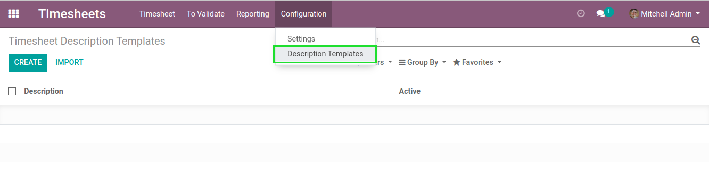
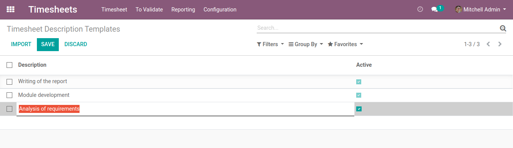
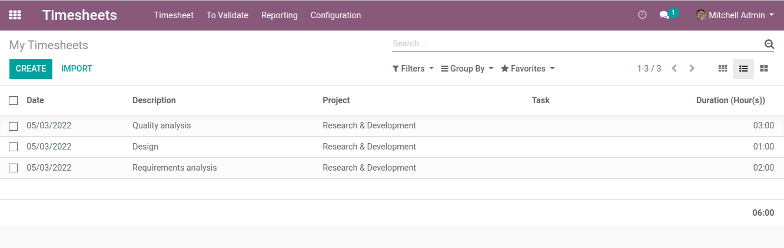
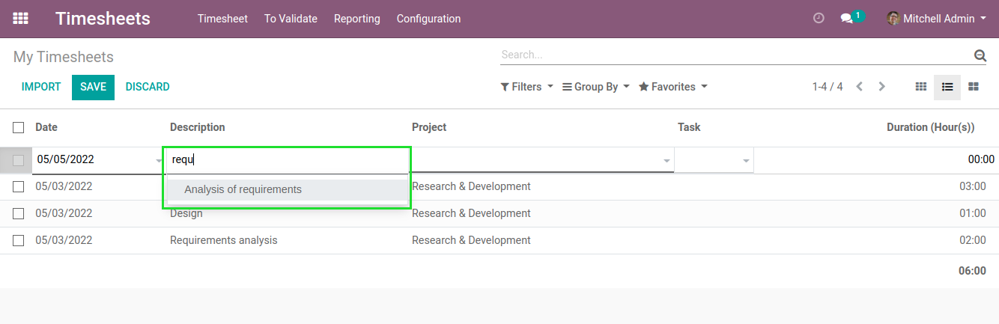
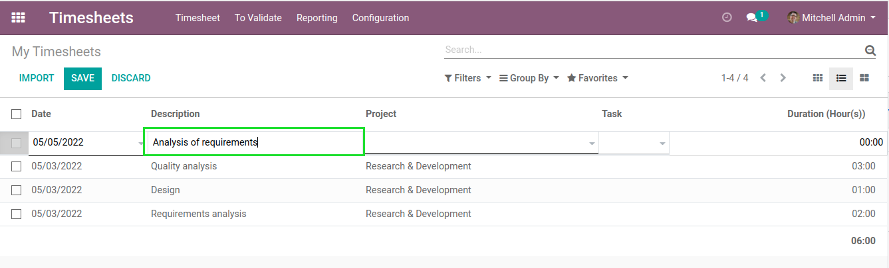
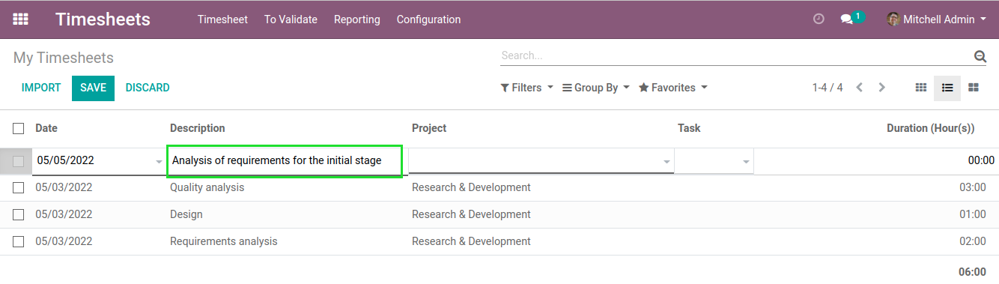

Timesheet Description Templates
===============================
This module allows to autocomplete timesheet descriptions.

.. contents:: Table of Contents

Usage
-----
As ``Timesheet / Manager``, I go to ``Timesheets / Configuration / Description Templates``.

I create a few records.

I go to the list view of timesheet entries.

As I begin typing the description, suggestions are proposed.

I can select one of these suggestions.

Then, I can manually customize the description for this timesheet entry.

Using the Widget
----------------
The autocomplete widget (``timesheet_description_autocomplete``) is added by default on the most common views of timesheets.

It can be added in other views (even other models than timesheets).
The only requirement is that the field must be a ``Char`` field.

Contributors
------------
* Numigi (tm) and all its contributors (https://bit.ly/numigiens)
