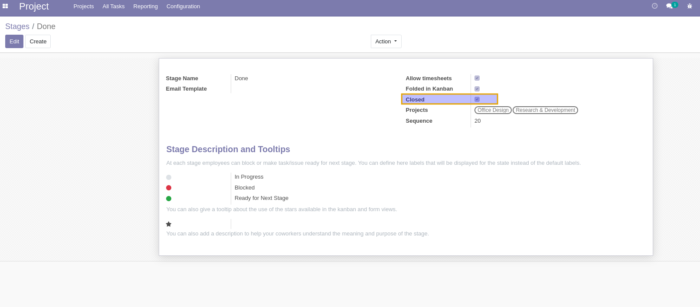
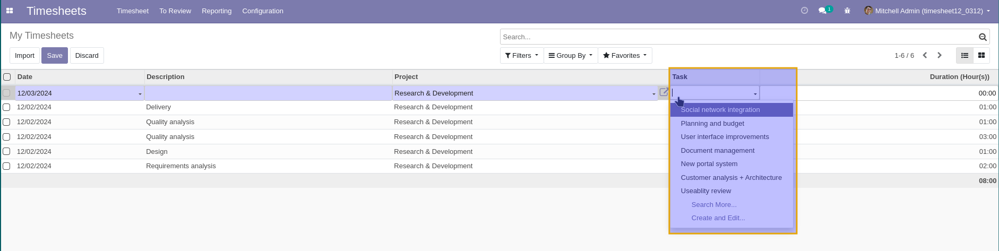
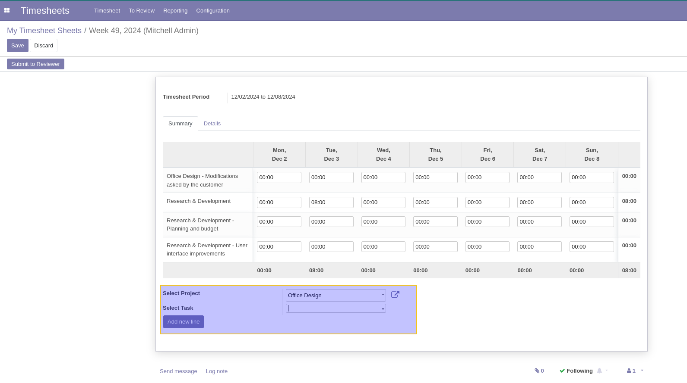
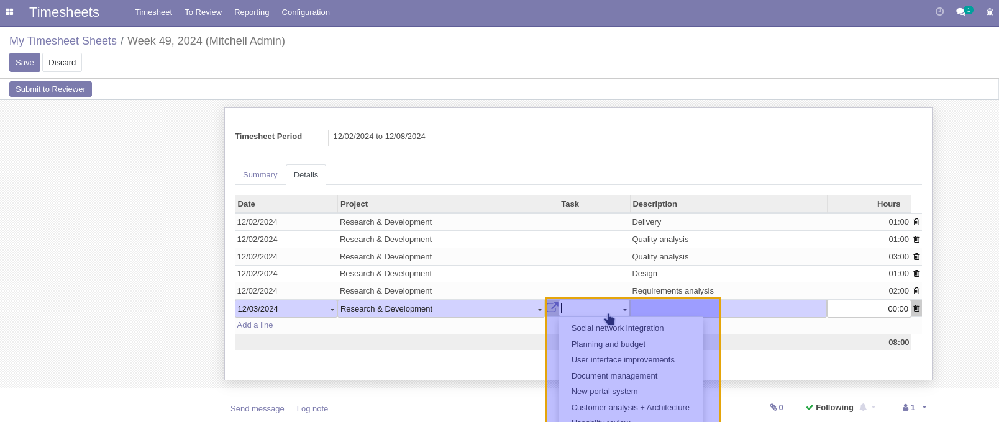

Timesheet Filter Closed Task
============================

This module ensures that only open tasks are displayed in the task selection list when recording timesheets. 

Usage
-----
As a user of timesheets, I perform the following steps:

1. Go to the **Stage form view** to define whether a stage is marked as closed.  
   The option `Closed` determines whether tasks in this stage should appear in the task selection list for timesheets.  

2. When creating a new timesheet in the **List view**, the system only displays tasks that are in open stages for the selected project.  
   Closed tasks are automatically excluded from the selection.

3. On the **Timesheet summary report**, I see that recorded timesheets respect the filtered task selection.  
   Tasks in closed stages are not available for timesheet entry.

Contributors
------------
- Numigi (tm) and all its contributors (https://bit.ly/numigiens)

More Information
----------------
- For questions or issues, meet us at https://bit.ly/numigi-com