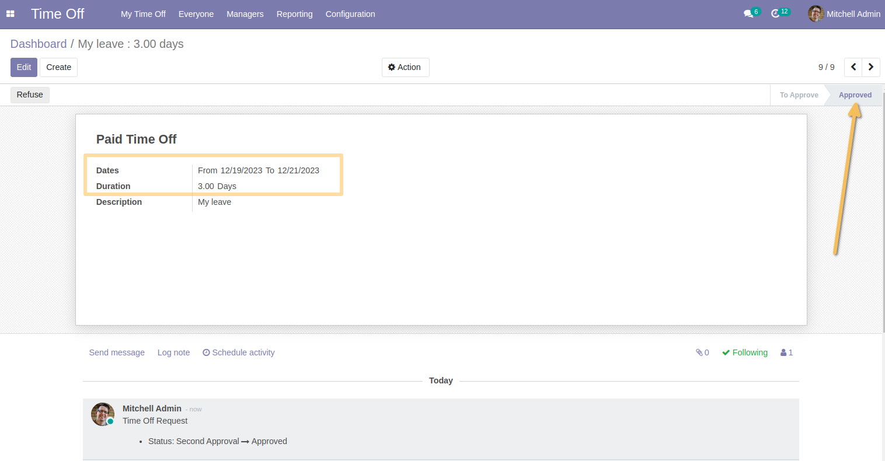
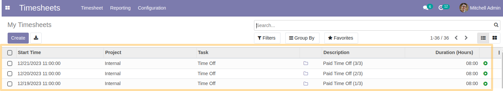

Timesheet Holidays Time Control Compatible
==========================================
This module allows to approve leave requests in advance while associating them with the date selected by the employee, rather than saving them on the validation date.

Usage
-----
As Leave Manager,
I validate leave for an employee requested for a later date,
Imputation on timesheets is made for the leave date and not the validation date

The leave is charged to timesheets whose date is equivalent to the leave date and not the validation date.

Contributors
------------
* Numigi (tm) and all its contributors (https://bit.ly/numigiens)
