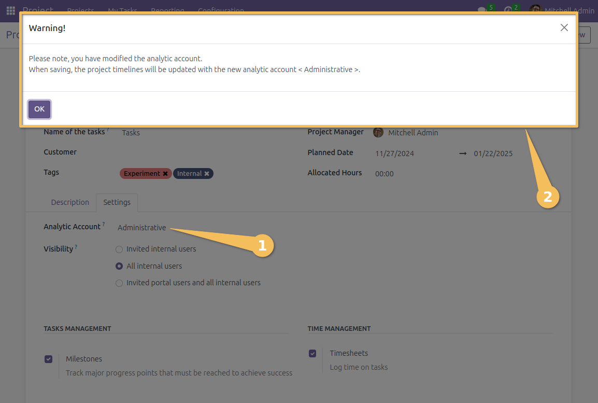

Timesheet Analytic Update
---------------------------------

When the analytic account of a project is modified, this module updates the analytic account of the project analytic lines.

A warning is displayed to the user, informing them of the modification.

In vanilla of Odoo, the field is visible only if the user has the access right to view/modify the analytic account of the project.
Like in the `Technical / Analytic Accounting` group.

Contributors
------------
* Numigi (tm) and all its contributors (https://bit.ly/numigiens)
