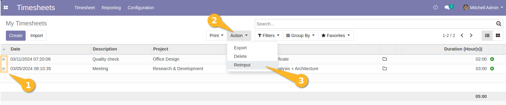
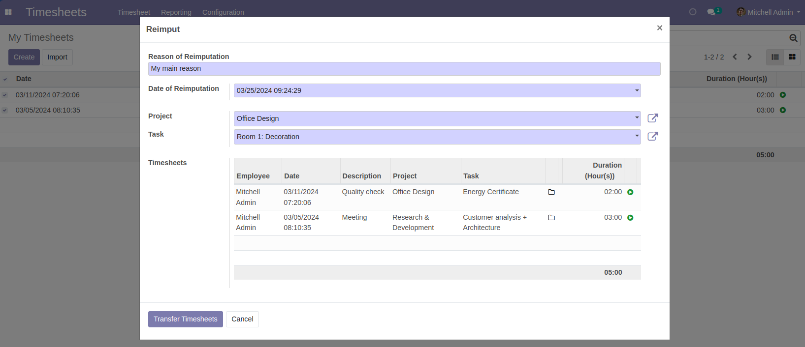
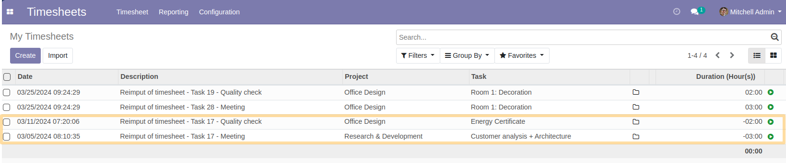
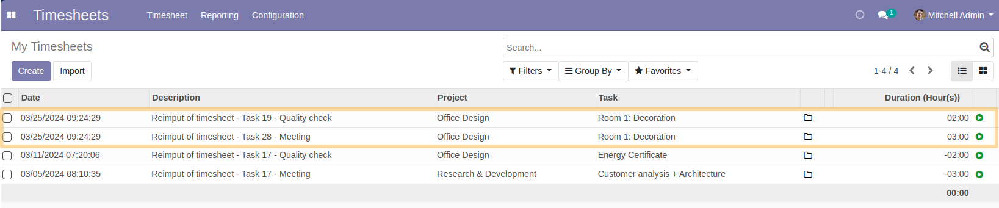
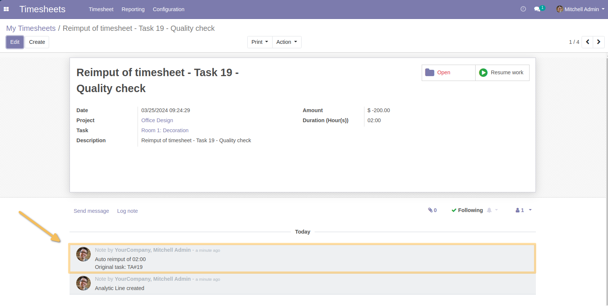
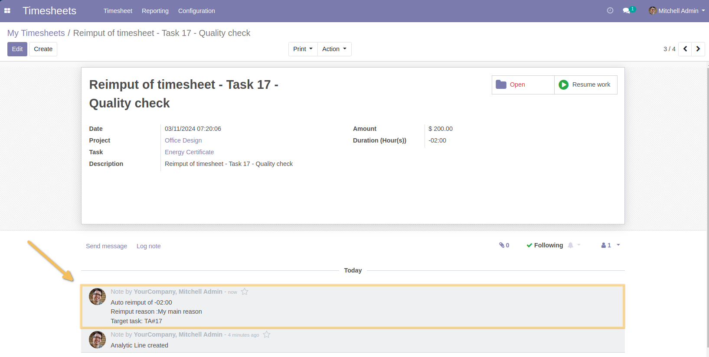
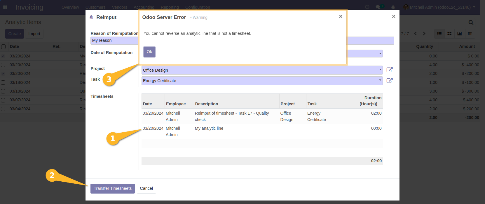

Timesheet Reallocate
====================
This module allows to automate a movement of the timeline from one project to another. 
The chatter must leave histories of these different operations carried out on the timelines.

Usage
-----

As a user with `Timesheets/Manager` rights, when I click on `Timesheet>Timesheet>All Timesheets`.
I can select the lines to modify, then I choose on the Action menu Reimput:

As soon as we choose reimput, a pop up is displayed to choose the new destination for the lines created.
The pop-up systematically displays the selected lines:

- The reimputation datetime is by default the date and time of the reimputation day but remains modifiable by the user, this field is in datetime format.
- The list of lines to be re-imputed is displayed for double checking. They are read-only.
- The pop up validation allows you to create for each line selected in the wizard, a negative line in the original Task (In the case of selecting lines that belong to different tasks) and a positive line in the target project at the level of the target task chosen at the pop up level.
- For each line chosen to be re-imputed, a line is created at the target task level.
- It is possible to choose only one target project and one task for the imputation of selected time line(s).

The line will automatically be added to the target project as positive and to the original project as negative.
The negative timeline on the original stain will have the following description:
*Reimput of timesheet” + Task ‘ID of the destination task‘ + the description in the original line*

The positive counterpart on the target task:

The different information on the original line remains the same on the line created at the target task except for the field:
Description will be : 
*Reimput of timesheet” + Task ‘Original task ID’ + the description in the original line*

A note is added to the Chatter of the target task including the original tasks of the lines as well as the total positive duration re-allocated:

A note is added to the Chatter of each original task of the timesheets citing: The negative total charged as well as the target task:

Exception and constraints
-------------------------
From the list view of analytical lines, if I select an analytical line that is not a timesheet, then when validating the reallocation wizard, a blocking error message is raised:
`You cannot reverse an analytic line that is not a timesheet.`

Contributors
------------
* Numigi (tm) and all its contributors (https://bit.ly/numigiens)
