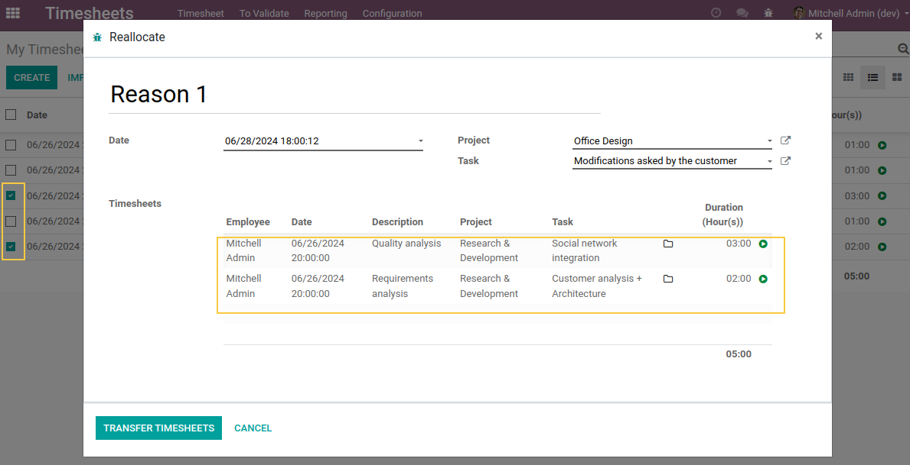
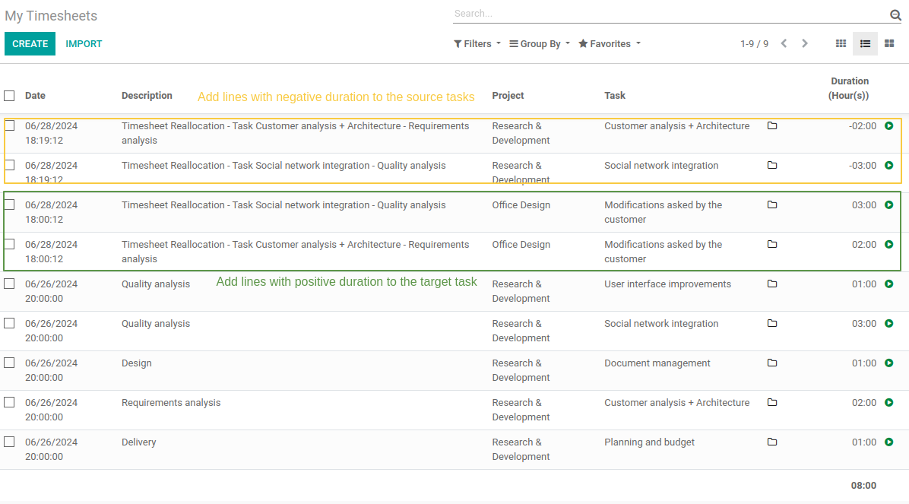
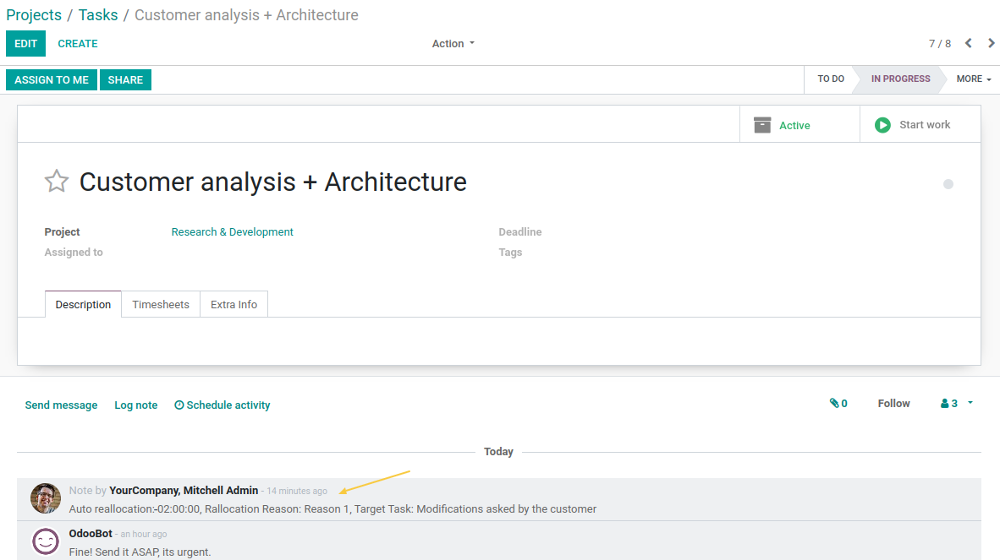
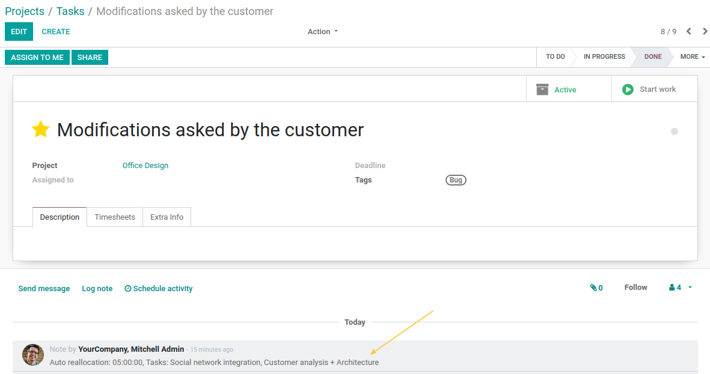
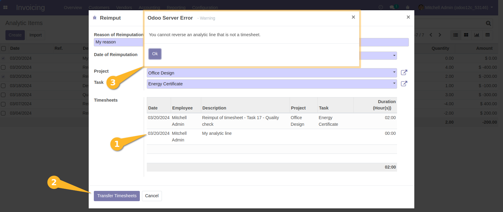

Timesheet Reallocate
====================
This module allows to move the timeline from one project to another. 

Usage
-----

As a user with `Timesheets/Manager` rights, when I click on `Timesheet>Timesheet>All Timesheets`.
I can select the lines to move, then I choose on the Action menu Reallocate.

A pop up is displayed to choose the new destination of the selected lines.

I click on `Transfer Timesheets`, two group of lines are created:

* Lignes with negative duration are added to the source tasks,
* Lignes with positive duration are added to the target task.

A note is added to the Chatter of each original task of the moved timesheets:

A note is added to the Chatter of the target task:

Exception and constraints
-------------------------
If I select an analytical line that is not a timesheet and try to reallocate the thimesheet, a blocking error message is raised:
`You cannot reverse an analytic line that is not a timesheet.`

Contributors
------------
* Numigi (tm) and all its contributors (https://bit.ly/numigiens)
