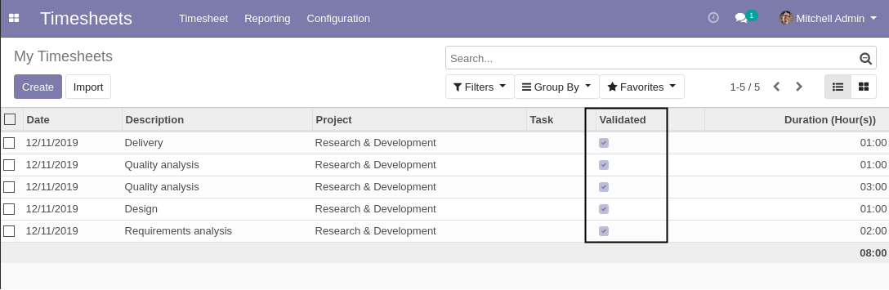

Timesheet Validation Status
===========================
This module allows to validate timesheets.

.. contents:: Table of Contents

Context
-------
In vanilla Odoo (community version), as of version 12.0, there is no mecanism to validate timesheets.

In Odoo enterprise, there is a mecanism, but it is based on a single date of validation per employee.
It does not keep track of which timesheet entry has been approved.
If a new timesheet entry is added by the employee, it will automatically be considered validated.

Summary
-------
This module adds a checkbox on timesheet lines to keep track of the validation status.

An action is added in list view to allow the manager to validate timesheets.
This feature is also available from the grid view (for Odoo enterprise users).

Timesheet Validation
--------------------
As member of the group ``Timesheets / Manager``, from the list view of timesheets,
I can validate a set of selected timesheet entries.

.. image:: static/description/timesheet_validate_action.png

After validating the timesheets, I notice that the checkbox ``Approved`` is checked.

Validated / To Validate Timesheets
----------------------------------
Two filters are are added in the list view of timesheets.

* Validated
* To Validate

.. image:: static/description/timesheet_filters.png

These filters allow to display / hide timesheets based on their validation status.

Contributors
------------
* Numigi (tm) and all its contributors (https://bit.ly/numigiens)
